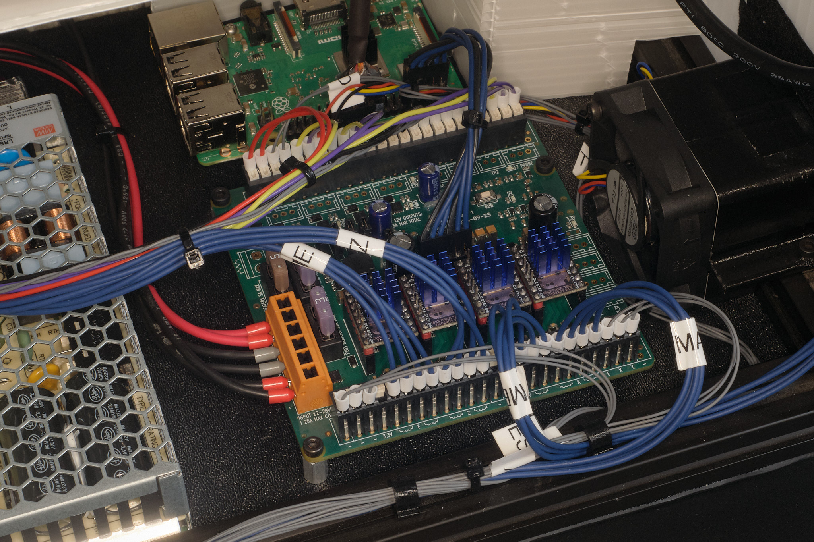
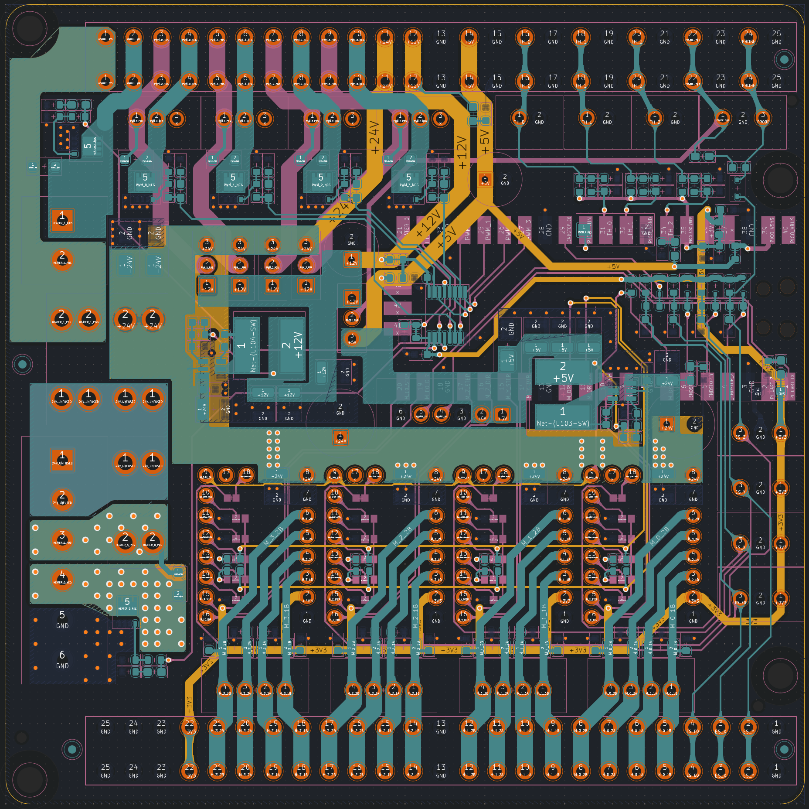
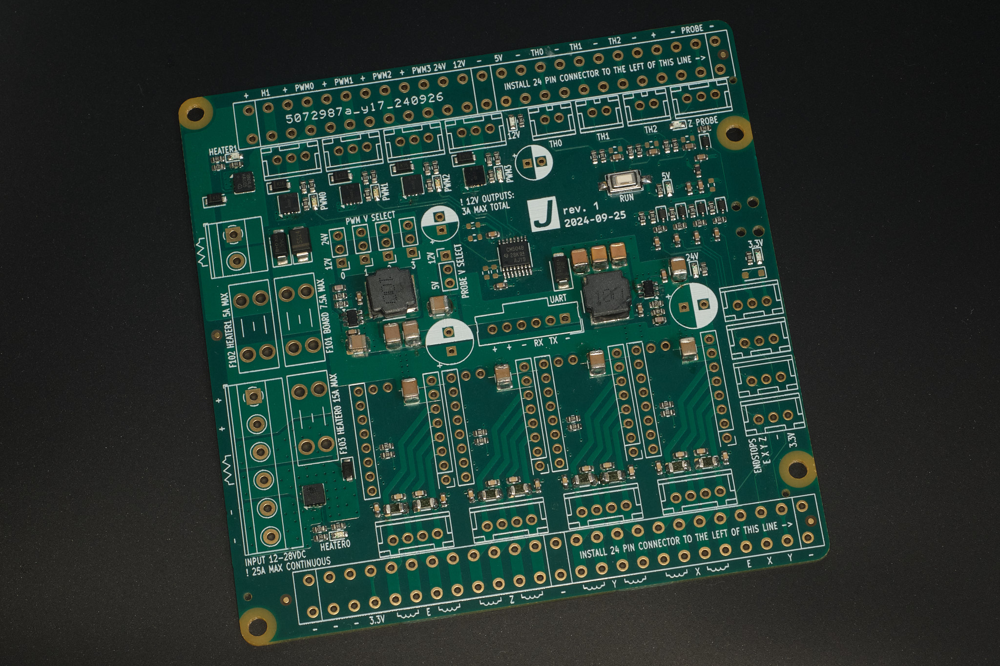
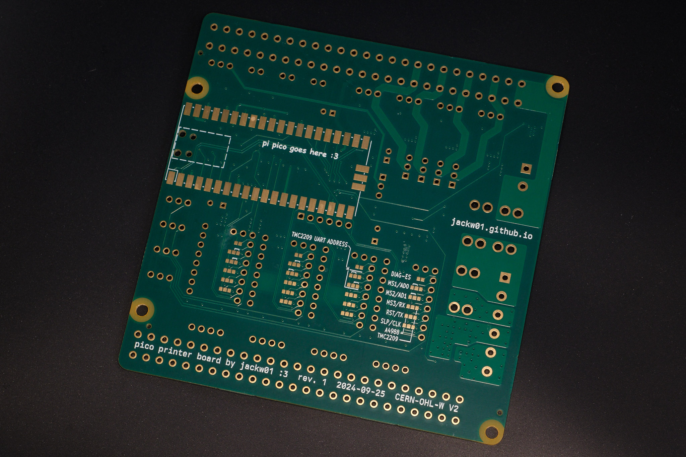
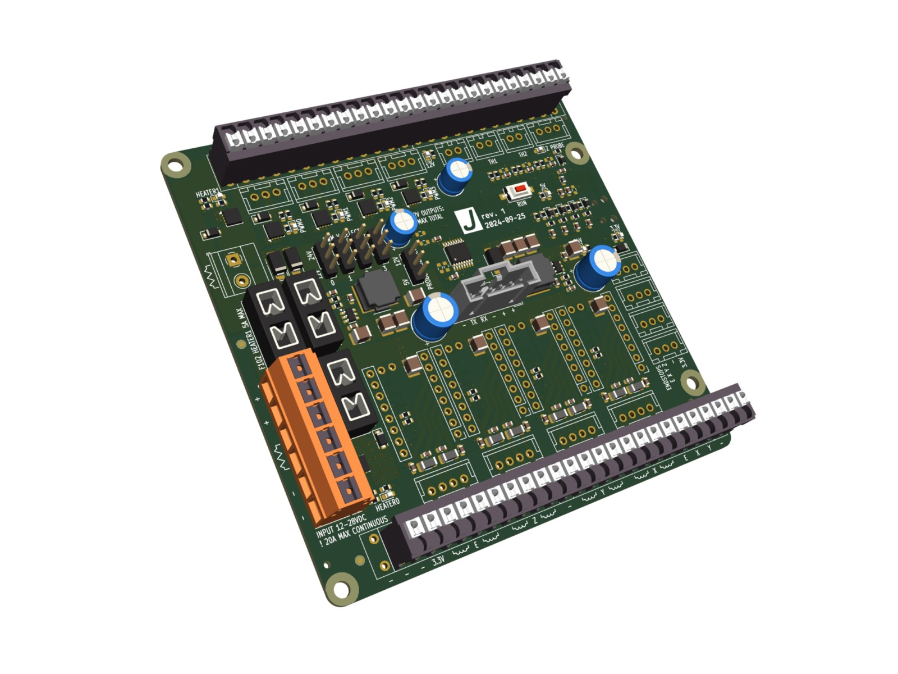

# pi-pico-printer-board

## Features

* Klipper compatible
* Uses Raspberry Pi Pico (RP2040)
* High reliability Weidmüller push-in connectors for all inputs and outputs
* 20A max and 7.5A max separately fused heater outputs
* 4x 3A max general purpose PWM outputs, individually configurable for 12V or 24V power, capable of driving inductive loads
* 3x thermistor inputs with 2.4Kohm pull up resistors
* 4x endstop inputs with one configurable for 5V or 12V operation for Z-probe
* 4x motor driver sockets
* Onboard 12V 3A and 5V 3A buck converters for powering accessories including Raspberry Pi
* Compatible with both 12V and 24V systems; components rated for 28V
* Compatible with both TMC2209 and A4988 motor drivers, and possibly others
* ESD and short-to-Vin protection on all microcontroller inputs
* Motor driver ESD and coil overvoltage protection
* Indicator LEDs for all power rails and outputs
* Alternatively supports 2.54mm pitch (Molex SL), or 2.5mm pitch (JST SM) headers for all inputs and outputs
* Labeled PCB for ease of setup and tinkering
* Open source PCB design

## Design

[Schematic as PDF](pcb/rpi%20pico%20printer%20board%20rev1%2020241010.pdf)

[Sample Klipper Configuration File](klipper/printer.cfg)

### License
This project is released under the CERN Open Hardware Licence Version 2 - Weakly Reciprocal (CERN-OHL-W V2).
